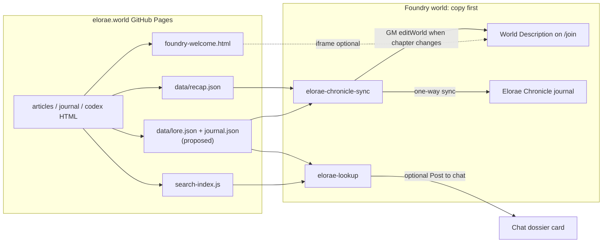
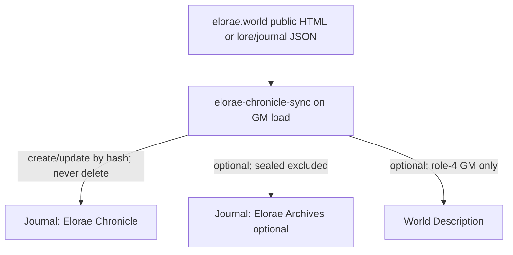

# Foundry VTT ↔ elorae.world integration

**Status:** research landed; **module zips packaged** under `docs/foundry-modules/` (lookup/chronicle-sync **v0.1.1**, calendar **v0.1.0**) for Devin review. **Not installed** in Foundry by this agent (no host `Data/modules` access). Join rewrite still off.  
**Date:** 2026-10-07  
**Campaign:** Devin’s tabletop (pf2e on Foundry)  
**Site:** https://elorae.world/ (static GitHub Pages, repo `elorae`)

## Not touching the real world

- **This task did not modify any Foundry world.** No login, no macros, no module installs, no `editWorld` calls.
- The **original / production world must never be changed** without Devin’s explicit approval for that specific change.
- The only approved playground is the Foundry world whose title/id is **`copy`** at `http://66.30.4.136:30000/`.
- Future Foundry modules must ship as **standalone zip files** for Devin to review and enable **per world** (copy first). Enabling a module in one world does not enable it in another.
- Every status report must name which world was tested, or state that **none** was.

### What this research pass observed (read-only)

| Check | Result |
|---|---|
| `GET /api/status` | `active`, Foundry **14.368**, world **`copy`**, system **pf2e 8.5.1**, 1 user connected |
| `GET /join` | Page `<title>` = **copy** |
| `GET /worlds/copy/world.json` | `id`/`title` = `copy`; World Description already holds the **inline Act III · Chapter XLI** recap written in an earlier copy-world test (`data-elorae-latest="iii-xli"`) |
| Logged into Foundry? | **No** |

Prior overnight work (2026-10-06) left draft modules and macros under `/workspace/foundry-modules/` (and a backup under `/workspace/backups/foundry-modules-20261006-0427/`). Those are **not** in this site repo and are **not** installed by this document.

---

## Goals (priority)

1. **Mid-game lookups** — players/GM look up Index/article lore from inside Foundry during play.
2. **Single source of truth** — lore stays on elorae.world (or a generated export from it); Foundry does not drift.
3. **World description / welcome auto-pull** — newest chapter recap on the `/join` screen without hand-editing Foundry each session.

---

## What the site already gives us

| Artifact | Role for Foundry |
|---|---|
| `search-index.js` | ~103 public + 12 private entries; Lookup can fetch + filter `private: true` |
| `data/recap.json` | Generated by `tools/recap.mjs` from newest `journal.html` chapter; CORS `*`, cache 600s |
| `foundry-welcome.html` | Static join-screen fragment (iframe style); keep in sync with newest chapter |
| `journal.html` | Newest chapter = first `<h1 id>` in `<main>` (newest-first) |
| `tools/build-site.py` | Sitemap / meta / search-index rebuild (hand-run, review, commit) |
| Edit mode + seals | `edit/` + sealed articles; public consumers must **exclude** sealed/private content |
| GitHub Pages headers | `Access-Control-Allow-Origin: *`, `cache-control: max-age=600` → browser fetches from Foundry work |

**Not published yet (proposed):** `data/lore.json`, `data/journal.json`, `data/version.json`. Draft generator lives outside the repo at `/workspace/foundry-research/proposals/tools/build-data.py` (sample output included there). Modules can scrape HTML today and switch to JSON when it ships.

---

## Recommended architecture (two preferred options)

### Option A — **Live fetch from the site** (preferred for lookups + join)

**Idea:** Foundry clients read public site assets over HTTPS. Lore is never duplicated by hand inside Foundry.

**Pros:** Always current (within Pages’ ~10 min cache); no second lore wiki; sealed pages stay out of public indexes.  
**Cons:** Needs network during play for live lookup (mitigated by optional offline journal sync).  
**Conflict rule:** Site HTML wins. Foundry stores only **mechanics** (actors, tokens, scenes, rolls) and **synced mirrors** tagged with content hashes; mirrors are overwritten on change, never hand-edited as canon.

### Option B — **One-way Chronicle mirror** (preferred for offline / “in the Journal directory”)

**Idea:** On GM load, Chronicle Sync pulls chapters (and optionally public lore) into Foundry journals. Players use Foundry’s native Journal UI; Lookup still hits the live site when online.

**Pros:** Works offline after sync; players already know Journals; newest chapter can auto-open once.  
**Cons:** Brief drift until next GM load; lore sync without `lore.json` is ~80–90 page fetches (turn off by default).

**Recommendation:** Ship **A + B together** as two small additive modules. Calendar (Valoran HUD) is a third, independent module and does not depend on the site.

Do **not** pursue: two-way sync, editing site content from Foundry, or storing secrets in public JSON.

---

## Concrete module / script ideas

Risk: **Low** = read-only / client UI; **Med** = writes Foundry documents in the enabled world; **High** = touches World Description / setup API (still only in the world where enabled).

| Name | What it does | Risk | Ship first? |
|---|---|---|---|
| **`elorae-lookup`** | Search site; open styled dossier; `/elorae <q>`; Post to chat; portrait popout; sidebar + scene-control entry | Low | **Yes** |
| **`elorae-chronicle-sync`** | One-way journal chapters → “Elorae Chronicle”; optional lore archives; optional player auto-open; optional join rewrite | Med–High (join off by default) | **Yes** (join setting off) |
| **`elorae-calendar`** | Valoran date HUD; `/date`; GM advance/set via offset so pf2e clock isn’t hijacked by “Set date” | Low–Med | Yes (independent) |
| **Macro `01-set-join-description`** | No module: GM pastes script; pulls newest chapter; writes **inline** World Description; backs up old text | High (copy-guarded) | **Immediate** copy test |
| **Macro `00-preflight`** | Asserts `game.world.id === "copy"`, role 4, site URLs 200 | Low | With join macro |
| **Site `tools/build-data.py`** (proposal) | Emit `lore.json` / `journal.json` / `version.json` + regenerate `foundry-welcome.html` | Low (site only) | After module install proven |
| **`/chronicle recap`** (future) | GM posts “Previously on…” card from newest chapter | Low | After Chronicle Sync |

Draft zips already exist at `/workspace/foundry-modules/*.zip` (v0.1.0, compatibility 13–14, verified 14.368). They have **live parser tests** and **mock Foundry glue tests**, but have **not** been confirmed inside a real Foundry UI in this pass.

### Mid-game lookup paths (goal 1)

| Path | Notes |
|---|---|
| Module UI + `/elorae` | Best UX; uses search-index or lore.json; fetches page HTML; strips sealed/private |
| Synced “Elorae Archives” journal | Offline; Foundry search; heavier sync |
| Macro that opens `https://elorae.world/search.html` | One-liner fallback; leaves Foundry |
| iframe of the site inside Foundry | Poor: sandbox, login/session, mobile; **not recommended** as primary |
| Compendium pack of HTML | Duplicates canon; drifts; **avoid** as source of truth |

### Single source of truth (goal 2)

| Stays on site (canon) | Stays in Foundry only |
|---|---|
| Articles, Index, Codex, Atlas, Journal prose, art URLs | Actors, tokens, scenes, play handouts that are session-only, initiative, loot, rolls |
| Generated `recap.json` / proposed `lore.json` | Module settings, calendar offset, Join Screen Backups journal |

**Direction:** site → Foundry only.  
**Conflicts:** if a synced journal page was edited in Foundry, next sync **overwrites** from site hash (document this in the module README). Better: treat synced pages as read-only for players (Observer) and discourage GM edits.  
**Secrets:** never export sealed / `private: true` / `data-owner` / encrypted visibility blobs into public JSON. Site sealing today is **not** cryptographic secrecy (vault codes live in client JS); treat sealed pages as “not for Foundry public mirrors” until real encryption lands.

### World description auto-pull (goal 3)

Important Foundry v14 facts (confirmed in prior copy research):

- Modules **do not run on `/join`**. Description must be **written ahead of time**.
- Write via setup action `editWorld` as a **full Gamemaster (role 4)** — not Assistant GM. There is no `game.world.update()`.
- Foundry sandboxes non-trusted iframes (`allow-scripts allow-forms` only) → **links inside `foundry-welcome.html` iframe are dead**.
- **Inline HTML** (top link + image + paragraphs with `target="_blank"`) survives `cleanHTML` and links work.

**Preferred join style:** **inline** (what copy already shows for III-XLI).  
**Iframe style:** only if Devin wants the framed look; keep a top-level chapter link above the frame; generate `foundry-welcome.html` from the same pipeline as `recap.json`.

Automation ladder:

1. **Now (copy):** run guarded macro `01-set-join-description.js` after each new chapter.  
2. **Then:** enable Chronicle Sync’s “Rewrite join-screen World Description” **only in copy**, style Inline.  
3. **Later (original world):** only with explicit approval — at minimum fix the broken `#/journal/…` deep link to `journal.html#iii-xli` (or let the same macro run after the `copy`-only guard is intentionally changed).

---

## What can ship as additive standalone modules first

Order that minimizes risk to play:

1. **Install zips into Foundry `Data/modules/`** (filesystem or Setup) — available to all worlds but **enabled only in `copy`**.
2. Enable **`elorae-lookup`** alone → smoke `/elorae vaerek`, sealed query should return nothing, Post to chat.
3. Enable **`elorae-chronicle-sync`** with join rewrite **off** → confirm “Elorae Chronicle” pages, player Observer, re-sync is a no-op when unchanged.
4. Enable **`elorae-calendar`** → set campaign date once; confirm pf2e clock still independent.
5. Optional: turn on join rewrite in **copy only**; verify `/join` after logout.
6. Site-side: add `tools/build-data.py` + Pages workflow to publish JSON (review diff, then commit) — modules already fall back to HTML scraping.

**Do not** enable any of this in the original world until copy tests pass and Devin says so.

---

## Open questions for Devin

1. **Join screen look:** keep **inline** (working article links) or prefer **iframe** (`foundry-welcome.html`) despite dead in-frame links?
2. **Who may look up mid-game?** Everyone, or GM-only for some categories (factions, spoilers)?
3. **Offline Archives:** sync public lore into Foundry journals, or live Lookup only?
4. **Calendar source of truth:** Valoran HUD only, or also try to drive / replace pf2e’s Golarion world clock?
5. **Module hosting:** keep manual zip install, or publish GitHub Releases with `manifest` URLs for one-click updates?
6. **Original world join fix:** approve a one-time description update (broken `#/journal/iii-xli` → `journal.html#iii-xli`) after copy is proven?
7. **Player names ↔ Foundry users:** map Jack/Jon/Julie/Kevin/Sawyer to ownership on synced pages later, or keep everything Observer?
8. **Secrets policy:** confirm nothing truly secret should appear in Foundry mirrors until encrypted visibility ships.

---

## Related paths (outside this commit)

| Path | Contents |
|---|---|
| `docs/foundry-modules/` | **Review zips + INSTALL.md** (in this repo) |
| `/workspace/foundry-modules/` | Draft module sources + zips + `_tests` + `copy-world-test/` macros |
| `/workspace/backups/foundry-modules-20261006-0427/` | Snapshot of the same |
| `/workspace/foundry-research/` | Earlier plan, ideas, sample `lore.json` / `journal.json`, proposed `build-data.py` |
| `/workspace/backups/foundry-copy-20261006T111026Z/` | Screenshots + logs from copy join-screen macro tests |

---

## Top 3 recommended next builds (after this doc)

1. **Copy-world install + smoke of `elorae-lookup`** (standalone zip; enable only in `copy`).  
2. **Copy-world enable of `elorae-chronicle-sync`** with join rewrite still off; run macro preflight + chronicle test.  
3. **Site export:** land `tools/build-data.py` (or fold into `build-site.py` / `recap.mjs`) so `data/lore.json` + `data/journal.json` + generated `foundry-welcome.html` publish with the site — then flip modules to prefer JSON.

Module **zips** (not full source trees) are in `docs/foundry-modules/` for review; install remains manual and copy-first. Source trees stay under `/workspace/foundry-modules/`.
